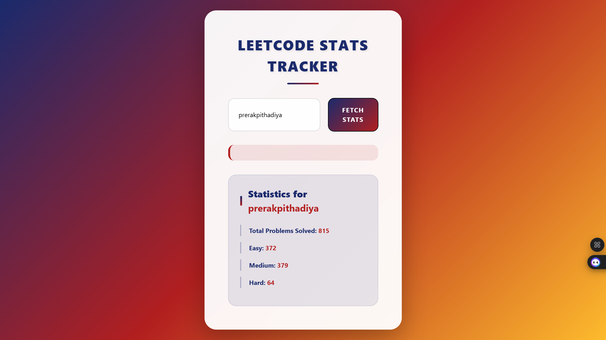

# LeetCode Stats Dashboard

A **responsive** and **user-friendly dashboard** that allows LeetCode users to view and track their progress in solving problems across different difficulty levels. This project provides a real-time display of your LeetCode statistics, such as the total number of problems solved and the breakdown of solved problems in **Easy**, **Medium**, and **Hard** categories.

## Features

- View **real-time stats** of your LeetCode profile.
- Track your problem-solving progress by difficulty (Easy, Medium, Hard).
- Built with **HTML**, **Tailwind CSS**, and **JavaScript**.
- Fetches live data from the LeetCode Stats API.

## Tech Stack

- **Frontend:**
  - HTML
  - Tailwind CSS (for responsive and modern design)
  - JavaScript (to fetch data and update UI)
- **APIs:**
  - LeetCode Stats API (to retrieve user stats)

## Screenshots



## Installation

To run this project locally on your machine, follow these steps:

1. **Clone this repository:**

   ```bash
   git clone https://github.com/PrerakPithadiya/LeetCode-Stats-Viewer.git

2. **Navigate to the project directory:**
   ```bash
   cd LeetCode-Stats-Viewer
   
3. **Install the required dependencies (if any):**
   ```bash
   npm install

4. **Open index.html in your browser:**
   - You can open the index.html file directly in your browser to see the dashboard.

## Usage

1. Enter your LeetCode username in the input field.
2. Click on the Fetch Stats button.
3. View your LeetCode profile statistics, including the total problems solved and breakdown by difficulty.

## Contributing

Contributions are always welcome! Feel free to fork the repository, make changes, and submit a pull request if you have suggestions or improvements.

## License
This project is open-source and available under the [MIT License](https://opensource.org/licenses/MIT).

## Acknowledgments
- [LeetCode Stats API](https://leetcode-stats-api.herokuapp.com/) for providing the data.
- [Tailwind CSS](https://tailwindcss.com/) for its amazing utility-first CSS framework.
- [JavaScript](https://developer.mozilla.org/en-US/docs/Web/JavaScript) for making the dynamic content possible.
